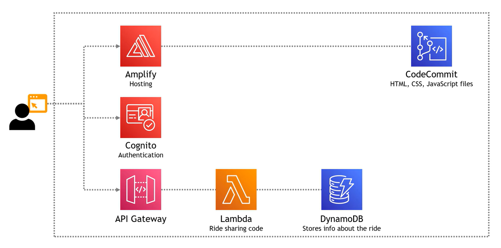

# cloud-project-2: WildRydes App
This is a simple uber-like app that riders can use to request for unicorn instead of regular taxis.

The code to create the website is stored in this s3 bucket: s3://ttt-wildrydes/wildrydes-site

Instructions on how to copy the code from s3 to codecommit is in the project description

Architectural diagram:
